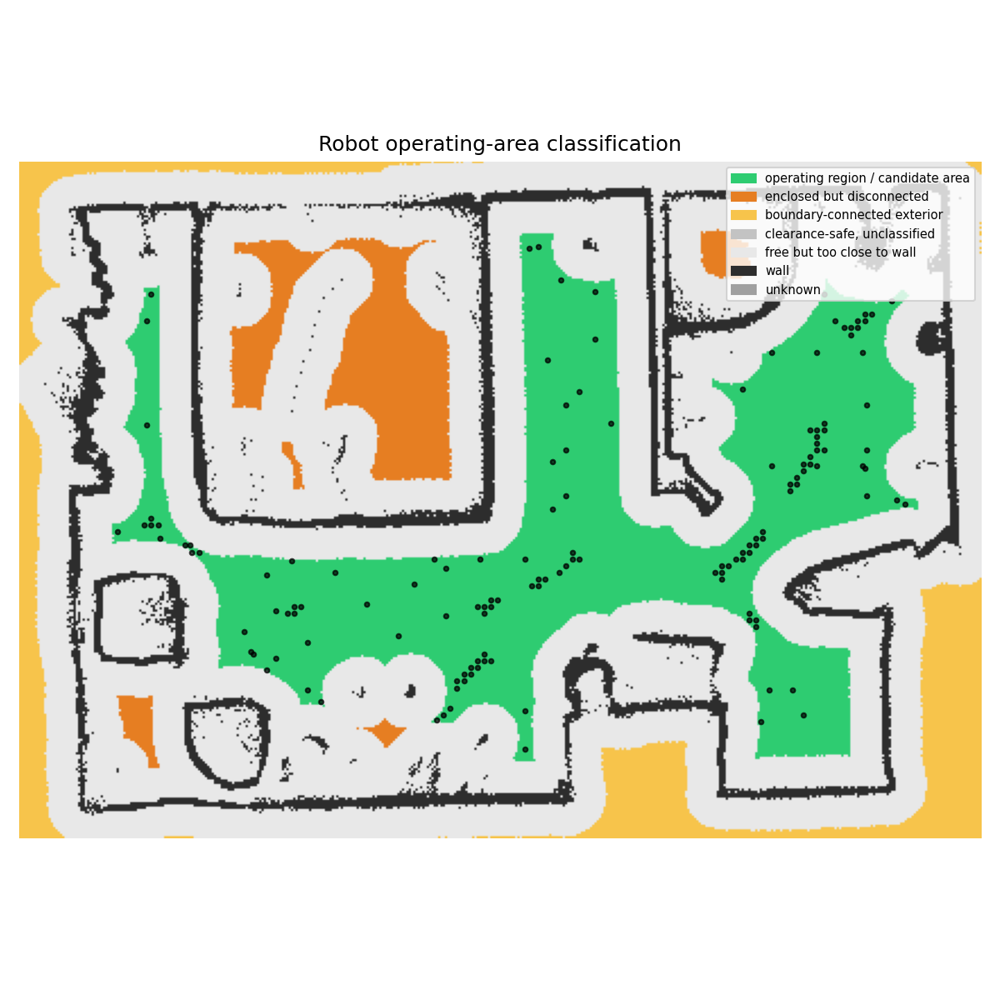
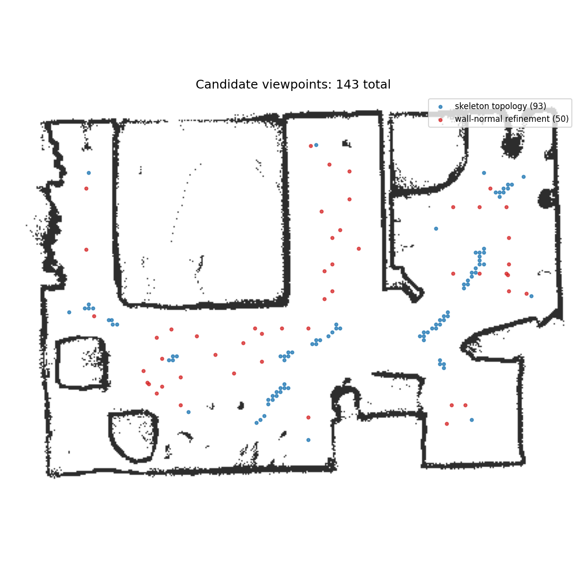
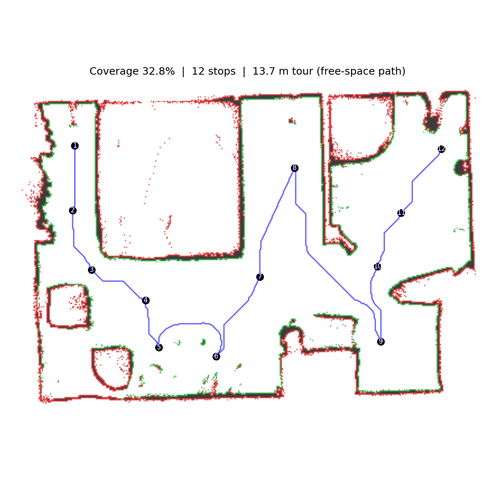

# Write-Up: Viewpoint Planning

## Approach

### 1. Find valid areas

- I build a free-space mask with the required 0.2 m robot clearance. (clearance_safe_mask)
- I remove clearance-safe cells connected to the map boundary as exterior
  space (`exterior_mask`), producing the enclosed mask (`enclosed_mask`). I
  then split the enclosed mask into connected components and retain the
  largest one as the operating area (`valid_mask`).
- This prevents stops outside the building, behind robot-sized gaps, or in
  sealed rooms.

### 2. Generate candidate viewpoints

I use two complementary candidate types. Topology candidates answer “where
are useful, safe places in the building to stand?”, while wall-normal
refinement candidates answer “where should the robot stand to obtain a direct,
high-quality view of a wall that those general positions miss?” Using both
keeps the initial pool compact while still handling difficult wall geometry.

#### Topology candidates
- I first reduce the valid free-space mask to a coarser topology map (about
  5 cm cells). This suppresses pixel-scale noise and thick/jagged raster
  walls, which would otherwise create many false skeleton branches.
- I then thin this coarse free-space map into a one-cell-wide centre-line
  skeleton. It is a raster approximation of the geometric medial axis: it
  captures the main centre lines of rooms and corridors without requiring
  exact continuous wall geometry (Zhang-Suen).
- Its corridor centre lines, endpoints, junctions, and range-spaced points on
  long branches become candidate viewpoints. Each is snapped to a valid map
  cell. These points represent the connectivity and broad layout of the floor
  plan, so they give good general coverage with relatively few candidates.
- More specifically, the algorithm counts the 8-neighbour degree of every
  skeleton pixel. Pixels with degree 1 are endpoints and pixels with degree 3
  or more are junctions; these are retained as topological feature candidates.
  Isolated degree-0 pixels are also retained. Degree-2 pixels are ordinary
  corridor interior and are not all retained.
- The algorithm then follows each branch between two feature candidates. If a
  branch is longer than the sensor's useful coverage range, it adds evenly
  spaced intermediate candidates along the branch. Thus a short branch uses
  its endpoints/junctions only, while a long corridor receives enough samples
  to avoid relying on one scan across its full length.
- The plotted topology candidates are not the skeleton drawn continuously;
  they are a sparse subset of skeleton features and samples. They can therefore
  look like disconnected point segments. Small clusters can also appear where
  raster noise creates several nearby junction-like skeleton pixels. Keeping a
  sparse subset avoids raycasting every skeleton pixel, many of which would be
  nearly identical viewpoints.

#### Wall-normal refinement

- I first raycast all topology candidates. A coverage gap is a scorer-
  observable wall cell that none of those candidates can see at the required
  quality.
- I group those gaps into wall regions and use representatives from the
  largest regions. For each representative wall cell, I identify the adjacent
  free-space direction: this is the wall-face normal pointing away from the
  wall.
- I generate positions along that normal at 0.75, 1.5, 2.5, 3.5, and 4.5 m,
  with lateral offsets of -0.3, 0, and +0.3 m. Only points in the clearance-
  safe operating region are retained.
- This supplies targeted alternatives for corners, recessed alcoves, hidden
  partition faces, and oblique views. A topology point may be structurally
  sensible but see such a wall at a grazing angle or not at all; a wall-normal
  point is deliberately placed to face it more directly.

### 3. Measure what each viewpoint sees

- I simulate one full 360-degree scan from each candidate and cache the wall
  cells reached by its rays. A ray stops at the first wall cell it hits, so
  walls behind another wall are occluded.
- A wall cell counts as covered only if its scan quality is at least the
  sensor threshold (`sensor.min_quality`, 0.5 in the default evaluation).
- Quality combines range and incidence angle:

  ```text
  quality = max(0, 1 - (range / max_range)^2) * clamp(cos(incidence_angle), 0, 1)
  ```

  `range` is the distance to the wall. `incidence_angle` is the angle between
  the exposed wall-face normal and the direction from the wall to the scanner.
  A close, head-on measurement has quality near 1; quality becomes 0 at
  maximum range or for a grazing view.
- This matters because oblique scans have weaker returns and poorer surface
  localization. It also gives wall-normal refinement candidates a meaningful
  advantage when they face a difficult wall directly.

### 4. Select the stops

- I apply deterministic greedy set cover: repeatedly select the candidate
  that adds the most previously unseen wall cells.
- After every greedy choice, I record the cumulative attainable coverage. This
  produces a curve with selected-stop fraction on the x-axis and attainable-
  coverage fraction on the y-axis.
- I first build the whole greedy curve, then select its knee: the point with
  the largest `coverage_fraction - stop_fraction`. Geometrically, this is the
  point furthest above the straight line from “zero stops, zero coverage” to
  “all greedy stops, full attainable coverage”. It marks the transition from
  high-return stops to the long tail where each extra stop adds little new
  coverage. The metric is scale-independent: it compares fractions, so it
  does not depend on the number of map pixels or generated candidates.
- I deliberately do not set a fixed minimum-coverage percentage. A fixed
  value such as 90% can be arbitrary across maps with different geometry and
  candidate pools; the knee adapts to the actual coverage trade-off. The
  caveat is that it can select too little coverage on an unusual curve. If a
  minimum coverage guarantee were required, I would choose the later of the
  knee stop and the first stop reaching that coverage floor.
- I then remove any selected stop that can be deleted without falling below
  the knee coverage level.

### 5. Order the tour

- For plans with at most 40 stops, I calculate the full pairwise,
  clearance-safe shortest-path matrix using the provided path planner. This
  measures drivable distance around walls rather than straight-line distance
  through them.
- For larger plans, a full-resolution path search from every stop is too slow.
  I use a hierarchical pathfinding abstraction (HPA*): the clearance-safe grid
  is divided into 0.6 m clusters. Runs of valid cells crossing a cluster
  boundary become a small number of actual doorway/region entrances. Stops and
  entrances connect only when they share a local free-space component; the
  tour distances are then shortest paths through this compact entrance graph.
  This preserves the map's room, corridor, and doorway connectivity without a
  whole-map search from every stop.
- HPA* was added because exact routing needs one whole-map Dijkstra search per
  selected stop. This was acceptable for small tours, but dominated planning
  time on the 65- and 96-stop maps. It changes only the distance estimates
  used to order already-selected stops: candidate generation, coverage, and
  stop count are unchanged. The evaluator still calculates the final tour on
  the original clearance-safe grid.
- The challenge provides no robot start pose. With `N` selected stops, I build
  `N` nearest-neighbour routes, using each stop once as the starting point.
  Each route repeatedly visits the closest unvisited stop according to the
  shortest-path distance matrix. I retain the shortest of these routes. The
  result is an open tour: it does not return to its first stop.
- I improve that nearest-neighbour route with deterministic 2-opt. 2-opt
  repeatedly tests whether reversing a contiguous route section shortens the
  total path; if so, it keeps the reversal. This removes local crossings and
  backtracking without changing the selected viewpoints or their coverage.

## Design Decisions & Tradeoffs

- Coverage is prioritized first, as required by the scorer. The knee rule is
  a deliberate compromise between wall coverage and stop count, rather than a
  fixed hand-tuned percentage.
- “Attainable” means visible from at least one generated valid candidate. The
  scorer can include exterior-facing or otherwise unreachable wall cells in
  its denominator; these cannot be recovered by adding valid stops inside the
  operating region.
- Candidate generation is topology-driven rather than a uniform 45 cm grid.
  This avoids arbitrary grid alignment while still placing views in room and
  corridor centres. The tradeoff is that thin/noisy raster walls can still
  affect the skeleton.
- Long-branch sampling uses the useful range for a perfectly head-on wall
  view. This keeps topology sampling simple, but is optimistic: an oblique
  wall has a shorter qualifying range. The final raycasts still apply the
  full incidence-aware quality formula, and wall-normal refinement adds more
  direct alternatives where topology candidates perform poorly.
- The full greedy curve is calculated before choosing its knee. This costs
  some selection work but does not require extra raycasts, since visibility is
  already cached per candidate.

## Debug Visualizations

Run an evaluation with both debug overlays enabled:

```bash
cd viewpoint_planning
./eval_runner.sh --map maps/4/room.yaml --debug-candidates --debug-areas
```

- `candidate_positions.png` shows the blue skeleton-topology candidates and
  red wall-normal refinement candidates.
- `area_classification.png` shows clearance-safe free space, boundary-
  connected exterior space, disconnected enclosed regions, and the final
  operating region from which candidates are allowed.
- Both images are written beside the normal evaluation report under
  `viewpoint_planning/results/`.

## Performance

Final local evaluation results are below. Coverage is the scorer-reported
fraction of observable wall cells at the required quality. These percentages
look low because the scorer's denominator includes every wall cell adjacent to
free map space, including exterior-facing walls and walls in sealed or
unreachable regions. They are therefore not the percentage of walls attainable
from the robot's selected indoor operating area.

| Map | Coverage | Covered cells | Stops | Tour length | Planning time |
| --- | ---: | ---: | ---: | ---: | ---: |
| 1 | 38.4% | 6,164 / 16,066 | 28 | 47.4 m | 25.8 s |
| 2 | 35.2% | 19,501 / 55,421 | 96 | 163.0 m | 26.0 s |
| 3 | 37.3% | 14,136 / 37,909 | 65 | 116.1 m | 24.8 s |
| 4 | 32.8% | 2,587 / 7,885 | 12 | 13.7 m | 2.9 s |
| 5 | 38.3% | 6,150 / 16,066 | 29 | 42.5 m | 16.8 s |

- All five runs produced zero invalid stops.
- Planning and candidate selection are deterministic; no random sampling or
  random seed is used.
- Maps 2 and 3 exceed the 40-stop cutoff and therefore use HPA*; the other
  maps use the exact full-resolution routing matrix. In particular, map 2's
  planning time fell from the exact-routing run of 221.5 s to 26.0 s.

<p align="center">
  
  
  
</p>

<p align="center">
  <em>Map 4 debug run. Left: area classification. Centre: candidate positions. Right: final viewpoint-planning result.</em>
</p>

## Known Limitations and Further Work

- The largest enclosed component is a practical proxy because the task has no
  robot start pose. A supplied start pose would allow selecting its reachable
  component exactly.
- HPA* routing is an approximation on large plans. Its local cluster links are
  straight-line shortcuts within a connected free-space component, so a wall
  detour contained entirely inside one cluster can be underestimated. The
  evaluator always reports the true clearance-safe route length, and every
  inter-cluster connection is still a real traversable entrance.
- The curve-knee rule is heuristic and may choose too few or too many stops
  on unusually shaped coverage curves. A tunable minimum coverage floor or a
  cost-aware objective could make that tradeoff explicit.
- Wall-normal refinement is limited to the largest uncovered clusters; small
  but important regions may be missed.
- With more time, I would compare against an ILP/set-cover formulation after
  candidate generation, and use stronger tour optimization or jointly
  optimize coverage and travel cost.
- Nearest-neighbour plus 2-opt is a fast routing heuristic, not an exact
  travelling-salesperson solver. It is used only after coverage and stop count
  are fixed, matching their higher priority in the scoring rubric.

## Modified Files

- `candidate_solution/solution.py`: planner, candidate generation, greedy
  coverage-knee selection, pruning, and routing.
- `sim/visibility.py`: incidence-angle-aware scan quality.
- `sim/scorer.py` and `eval.py`: optional progress logging and debug images
  for candidates and free-space-area classification.
